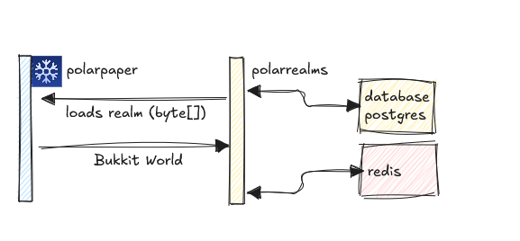

    

<h1 align="center">Polar Realms - WIP 🏝️</h1>

Polar Realms is a world management plugin for paper servers. This plugin is still in development.

Even-tough this plugin is designed to be used on wandoria.net, it is designed to be extendable.

# Features

Documentation is using Writerside

- [ ] Multi-Server compatibility
    - [x] SFTP / SSH Storage (PolarPaper format byte-files)
    - [ ] Postgresql Storage?
- [ ] Property System
    - [ ] Fixed Properties (Spawn, ...)
    - [ ] json

# Dependencies

- [PolarPaper](https://github.com/MinehubMC/PolarPaper) | Very small world format
- Redis
- Postgres 
