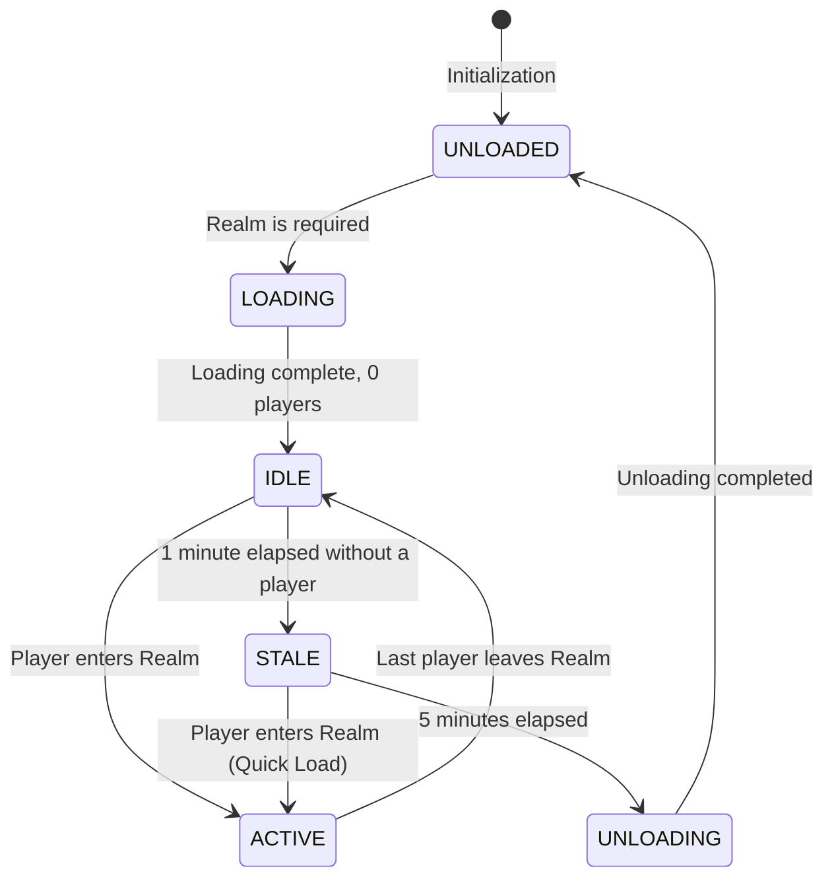
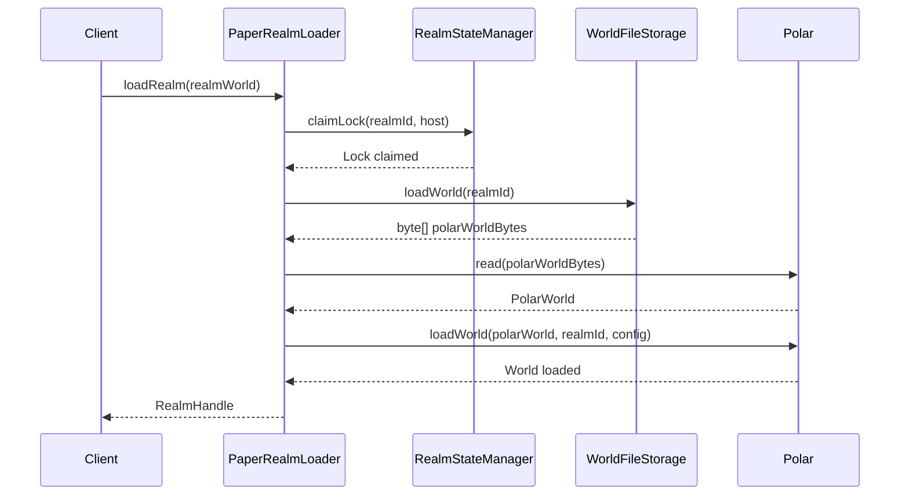

# Realm Lifecycle

The realm lifecycle describes the different states a realm can be in, from creation to deletion. The lifecycle is managed by the `RealmStateManager` and the `PaperRealmLoader`.

## States

- **UNLOADED**: This is the standard state for a realm. The realm is not loaded into memory.
- **LOADING**: The realm is in the process of being loaded.
- **IDLE**: The realm is loaded, but no players are currently in it.
- **ACTIVE**: The realm is loaded and has at least one player inside.
- **STALE**: The realm has been in the `IDLE` state for one minute. It remains in this state for five minutes before being unloaded. This allows for quick loading if a player re-enters the realm shortly after leaving.
- **UNLOADING**: The realm is in the process of being unloaded.

## Realm Loading and State Management

The `PaperRealmLoader` and `RealmStateManager` work together to manage the realm lifecycle. The `RealmStateManager` uses Redis for atomic operations to ensure that only one server can load a realm at a time.

Here's a sequence diagram that illustrates the process of loading a realm:

This process ensures that realms are loaded safely and efficiently across a multi-server environment.